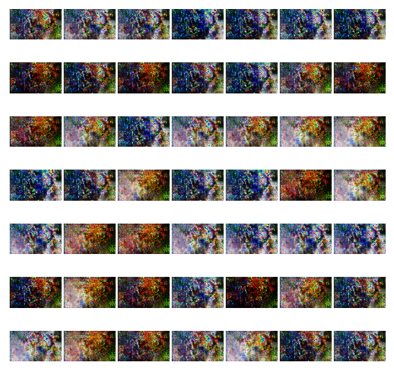
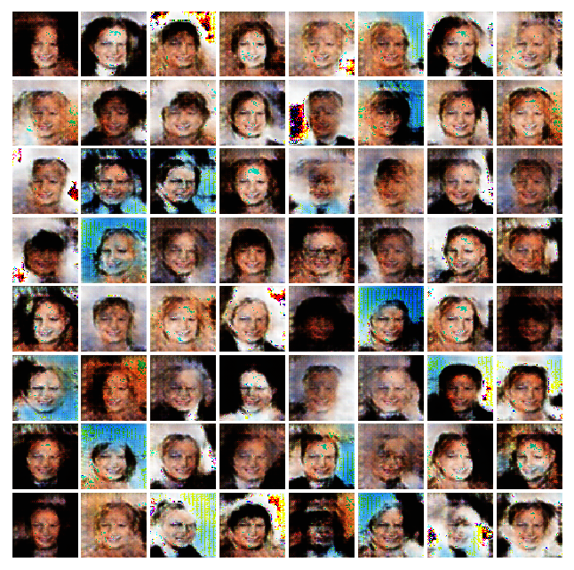

# DCGAN - Tensorflow
Generate new DOTA2 heroes 

Test Done:
1. Generate 48x80 dimension fake Dota2 heroes images.
20mins to finish 5000 steps
There were only 100 heroes images(And they're very distinct) so it was impossible to generate clear novel new hero images.  
Results are undesirable compared to celebA dataset, which has 100000 images, and humance faces share similar shape

2. Generate 64x64 dimension fake celebrity images. (30 mins training for 5000 steps, 3 epochs)

# 1. Dota2 heroes
## Ground Truth Examples

## 0 step

## 300 step

## 500 step

## 1000 step

## 1500 step

## 2000 step

## 2500 step

## 3000 step

## 4000 step

## 5000 step

## 5000 step

## 5200 step

# 2. Celebrity face images
## 0 step

## 500 step

## 1000 step

## 1500 step

## 2000 step

## 2500 step

## 3000 step

## 4000 step

## 4900 step

## 5000 step

